# Kule

**AI ajanları için kontrol kulesi.** Kule, bir ekibin yapay zekâ destekli kodlama ajanlarını
merkezî bir yerden yönetmesini sağlar: görevler panodan dağıtılır, ajanlar geliştiricinin kendi
makinesinde çalışır, riskli her işlem bir insan onayından geçer ve yapılan her şey kalıcı olarak
kayda girer.

Çok kiracılıdır (multi-tenant): aynı kurulum birden fazla organizasyona hizmet eder ve
organizasyonlar birbirinin verisini veritabanı seviyesinde göremez.

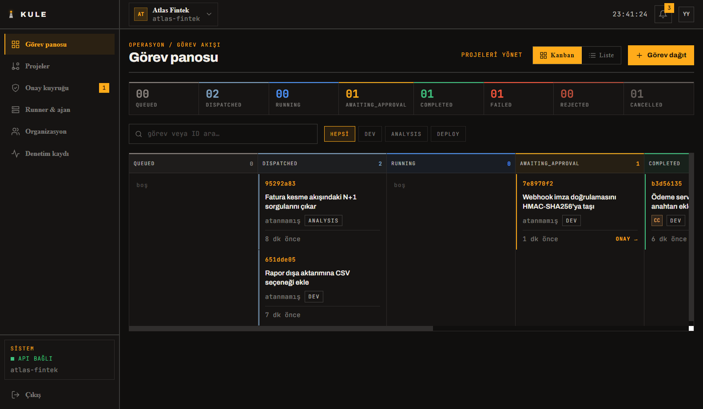

---

## İçindekiler

- [Neden](#neden)
- [Ekranlar](#ekranlar)
- [Mimari](#mimari)
- [Teknoloji yığını](#teknoloji-yığını)
- [Depo yapısı](#depo-yapısı)
- [Hızlı başlangıç](#hızlı-başlangıç)
- [Uçtan uca senaryo](#uçtan-uca-senaryo)
- [Güvenlik modeli](#güvenlik-modeli)
- [Testler](#testler)
- [Yapılandırma](#yapılandırma)

---

## Neden

Yapay zekâ destekli kodlama araçları hızla yaygınlaştı, ancak kurumsal bir ekipte üç soru
cevapsız kalıyor:

| Soru | Kule'nin cevabı |
|---|---|
| Kim, hangi görevde, hangi komutu çalıştırdı? | Her görev, her log satırı ve her durum geçişi kalıcı olarak saklanır; denetim kaydı değişmezdir. |
| Riskli bir komut çalışmadan önce kim onay verdi? | `git push`, `run_command` ve korunan dosyalara yazma işlemleri onay kuyruğuna düşer; onaylayan kişi çalıştırılacak komutu görerek karar verir. |
| Kaynak kod şirket dışına çıkıyor mu? | Ajanlar geliştiricinin kendi makinesindeki runner üzerinde çalışır. Sunucu yalnızca görev ve log taşır; depo hiçbir zaman sunucuya kopyalanmaz. |

---

## Ekranlar

### Görev detayı — canlı log akışı

Görev çalışırken üretilen her satır WebSocket üzerinden anlık olarak akar ve aynı anda
veritabanına yazılır. Sayfa kapatılıp tekrar açıldığında geçmiş kayıtlar yerinde durur.

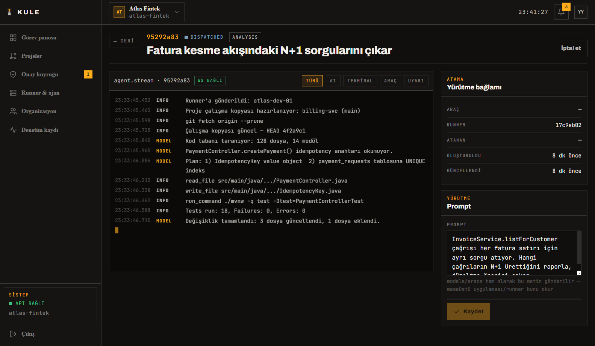

### Onay kuyruğu — insan kapısı

Bir ajan riskli bir araç çağırdığında iş orada durur ve görev `AWAITING_APPROVAL` durumuna geçer.
Onaylayan kişi yalnızca "onay isteniyor" uyarısını değil, **çalıştırılacak komutun kendisini**
görür.

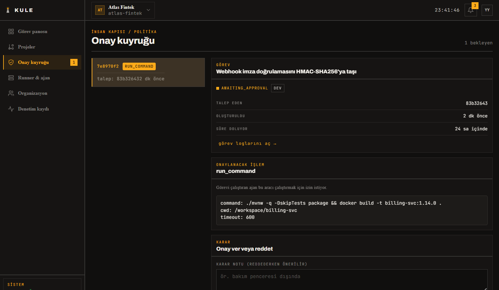

### Masaüstü uygulaması — görevin fiilen yürütüldüğü yer

Görev dağıtıldığında geliştiricinin makinesinde bir çalışma penceresi açılır: solda projenin
otomatik klonlanmış çalışma kopyası, ortada gerçek bir PTY üzerine kurulu gömülü terminal, altta
git araç çubuğu. Terminalde yapılan her şey göreve kalıcı olarak yazılır.

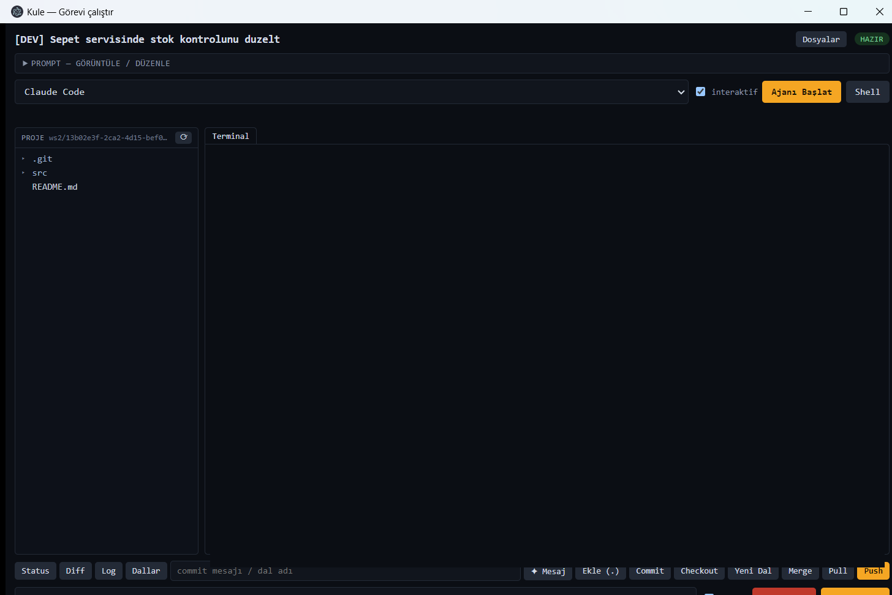

### Runner ve ajan bağlantıları

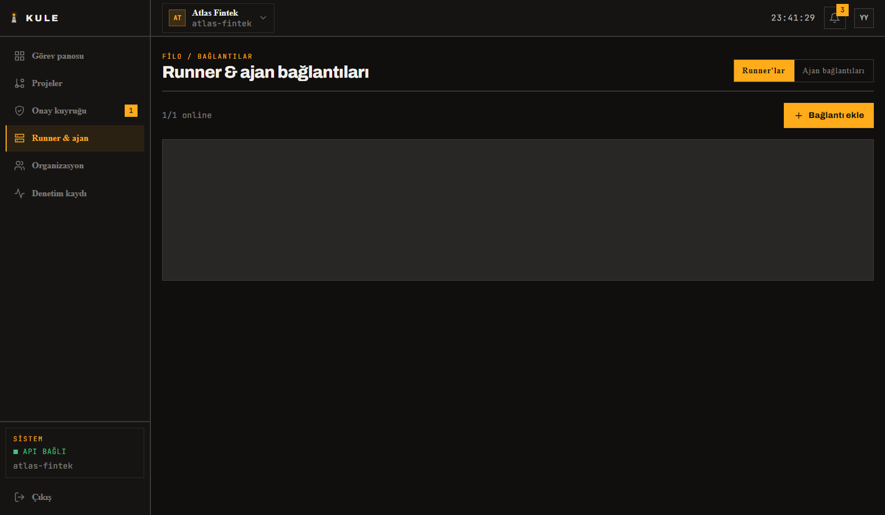

### Denetim kaydı

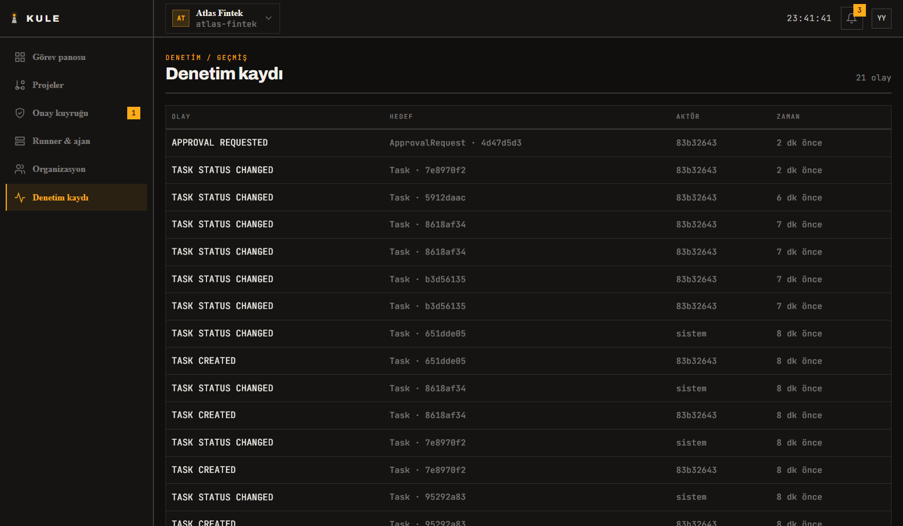

<details>
<summary>Diğer ekranlar</summary>

**Giriş**

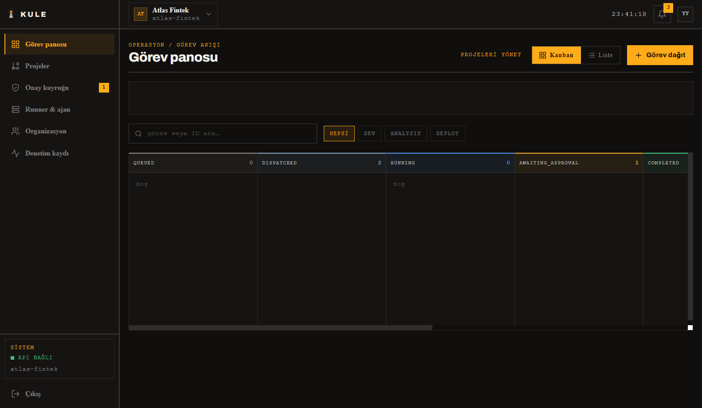

**Projeler**

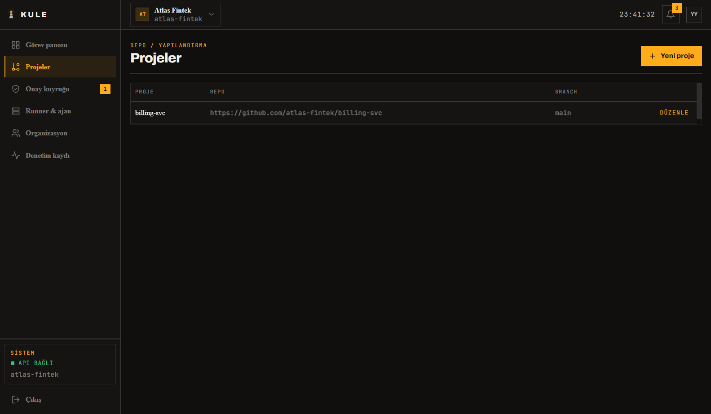

**Organizasyon ve üyeler**

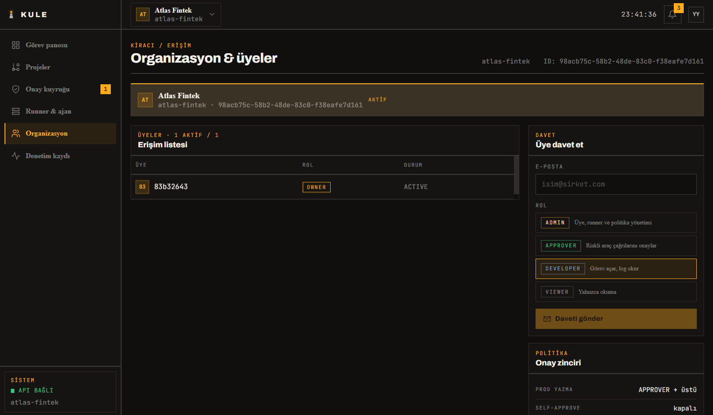

</details>

---

## Mimari

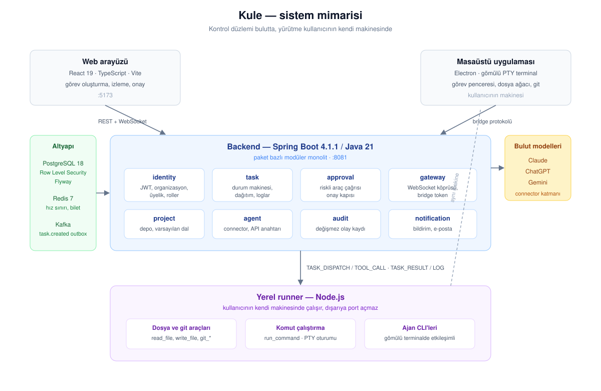

Sistem üç parçadan oluşur:

**Backend** kontrol düzlemidir. Paket bazlı (package-by-feature) modüler bir monolittir; her
modül kendi `domain`, `repository`, `service`, `dto` ve `controller` katmanını taşır. Controller
katmanı repository'ye doğrudan erişmez, entity dışarı dönmez ve transaction yalnızca servis
katmanında açılır.

**Yerel runner** kullanıcının kendi makinesinde çalışan bir Node.js uygulamasıdır. Backend'e
WebSocket ile kendisi bağlanır, dışarıya hiçbir port açmaz. Dosya okuma/yazma, komut çalıştırma
ve git işlemlerinin gerçek uygulaması buradadır; her dosya yolu proje köküne göre çözülür ve kök
dışına çıkan yollar reddedilir.

**Masaüstü uygulaması** runner'ı arka planda barındırır ve görevi çalıştırma deneyimini tek bir
pencerede toplar. Elinde kullanıcıya ait bir token yoktur; görev tamamlama ve prompt güncelleme
gibi işlemleri de köprü protokolü üzerinden yapar.

### Görev durum makinesi

Geçiş kuralları iki yerde birden uygulanır: servis katmanındaki `TaskStateMachine` ve veritabanı
tetikleyicisi. Uygulamada bir hata olsa bile geçersiz bir geçiş veritabanına yazılamaz.

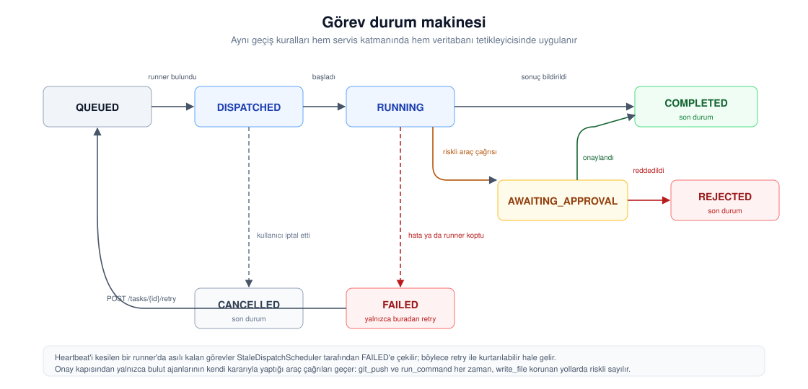

### Köprü protokolü

Backend ile runner arasında taşınan bütün mesajlar tek bir kayıt tipiyle modellenmiştir:

| Tip | Yön | Anlamı |
|---|---|---|
| `HEARTBEAT` | runner → backend | Bağlantı canlı, runner ayakta |
| `TASK_DISPATCH` | backend → runner | Yeni görev, prompt ve proje bilgisiyle |
| `TASK_RESULT` | runner → backend | Görev tamamlandı ya da başarısız oldu |
| `LOG` | runner → backend | Göreve kalıcı olarak yazılacak log satırı |
| `TOOL_CALL` / `TOOL_RESULT` | çift yönlü | Bulut modelinin istediği araç çağrısı ve cevabı |
| `TERMINAL_*` | çift yönlü | Canlı terminal oturumu (aç, girdi, çıktı, boyutlandır, kapat) |
| `TASK_PROMPT_UPDATE` | runner → backend | Masaüstünden düzenlenen prompt metni |
| `AI_ASSIST_REQUEST` / `AI_ASSIST_RESULT` | çift yönlü | Commit mesajı, kod incelemesi gibi tek atışlık yardımlar |

Bağlantı koptuğunda kaybolmaması gereken mesajlar (`TASK_RESULT`, `LOG`, `TASK_PROMPT_UPDATE`)
runner tarafında bir kuyruğa alınır ve yeniden bağlanınca gönderilir.

---

## Teknoloji yığını

| Katman | Kullanılanlar |
|---|---|
| Backend | Java 21, Spring Boot 4.1.1, Spring Security, Spring Data JPA, Jackson 3 |
| Veri | PostgreSQL 18 (Row Level Security), Flyway, Redis 7, Apache Kafka (KRaft) |
| Web arayüzü | React 19, TypeScript, Vite, TanStack Query |
| Runner | Node.js, `ws`, node-pty |
| Masaüstü | Electron, xterm.js, highlight.js |
| Test | JUnit 5, Mockito, AssertJ, MockMvc, Vitest, Testing Library |

---

## Depo yapısı

```
.
├── src/main/java/com/AgentSaasAplication/
│   ├── identity/        kullanıcı, organizasyon, üyelik, kimlik doğrulama
│   ├── project/         proje ve depo bilgileri
│   ├── task/            görev, durum makinesi, dağıtım, loglar
│   ├── approval/        onay kapısı ve onay istekleri
│   ├── agent/           bulut modeli bağlantıları ve connector katmanı
│   ├── runner/          runner kayıtları, yetenekler, terminal oturumları
│   ├── gateway/         WebSocket köprüsü ve bridge token'ları
│   ├── audit/           değişmez denetim kaydı
│   ├── notification/    bildirimler ve e-posta
│   ├── common/          çok kiracılılık, güvenlik, ortak entity'ler
│   └── config/          güvenlik, JWT, Redis, WebSocket yapılandırmaları
├── src/main/resources/db/migration/   Flyway migration dosyaları
├── frontend/            React arayüzü
├── agentsaas-local-bridge/   yerel runner (Node.js)
├── agentsaas-desktop/        masaüstü uygulaması (Electron)
├── docker/              yerel geliştirme altyapısı ve imaj tanımı
└── docs/                mimari diyagramları ve ekran görüntüleri
```

---

## Hızlı başlangıç

### Ön gereksinimler

- JDK 21
- Node.js 20+
- Docker (PostgreSQL, Redis, Kafka, Mailhog için)

### 1. Altyapıyı başlat

```bash
docker compose -f docker/docker-compose.yml up -d
```

### 2. Ortam değişkenlerini hazırla

```bash
cp .env.example .env
```

`JWT_SECRET` ve `API_KEY_SECRET` zorunludur; ikisi de base64 ve en az 32 byte olmalıdır:

```bash
openssl rand -base64 32
```

Yerel geliştirmede `.env` yerine `local` profili kullanılır; örnek dosyayı kopyalayıp
aynı iki anahtarı doldurmak yeterlidir:

```bash
cp src/main/resources/application-local.properties.example src/main/resources/application-local.properties
```

### 3. Backend'i çalıştır

```bash
./mvnw spring-boot:run -Dspring-boot.run.profiles=local
```

Backend `http://localhost:8081` adresinde açılır.

### 4. Web arayüzünü çalıştır

```bash
cd frontend
cp .env.example .env
npm install
npm run dev
```

Arayüz `http://localhost:5173` adresinde açılır. Kayıt olup bir organizasyon kurduğunuzda
kurucu hesap otomatik olarak `OWNER` rolünü alır.

### 5. Runner'ı bağla

Arayüzde **Runner & ajan → Bağlantı ekle** ile bir runner kaydedin, ardından **Bridge token
oluştur** deyin. Token yalnızca bir kez gösterilir.

```bash
cd agentsaas-local-bridge
npm install
cp config.example.json config.json   # token, organizasyon kimliği ve proje kökünü doldurun
node runner.js
```

Runner bağlandığında arayüzdeki durumu `ONLINE` olur.

### 6. Masaüstü uygulaması (isteğe bağlı)

Runner'ı elle başlatmak yerine masaüstü uygulaması kullanılabilir; bağlantıyı sistem tepsisinde
arka planda tutar ve dağıtılan görevler için otomatik olarak bir çalışma penceresi açar.

```bash
cd agentsaas-desktop
npm install
npm start
```

---

## Uçtan uca senaryo

1. **Proje oluştur.** Depo adresini ve varsayılan dalı girin.
2. **Görev dağıt.** Başlık, tip (`DEV` / `ANALYSIS` / `DEPLOY`) ve ajana gidecek prompt metnini
   yazın. Görev `QUEUED` durumunda oluşur.
3. **Dağıtım.** Uygun yetenekteki çevrimiçi bir runner bulunur ve görev `DISPATCHED` olur.
   Masaüstü uygulamasında çalışma penceresi açılır, proje otomatik klonlanır.
4. **Çalıştırma.** Ajan gömülü terminalde çalışır. Ürettiği her satır görev logu olarak akar.
5. **Onay.** Ajan riskli bir araç çağırırsa iş durur, görev `AWAITING_APPROVAL` olur ve
   onay kuyruğuna düşer. Onay verilirse çağrı çalışır, reddedilirse görev durur.
6. **Tamamlama.** Sonuç açıklamasıyla birlikte görev `COMPLETED` ya da `FAILED` olur; terminal
   çıktısı kalıcı olarak göreve yazılır.

---

## Güvenlik modeli

**Kiracı izolasyonu veritabanı seviyesindedir.** Her kiracıya ait tablo `FORCE ROW LEVEL SECURITY`
ile korunur. Gelen istekteki organizasyon kimliği doğrulanır, istek boyunca taşınır ve transaction
açılırken veritabanı oturumuna yazılır. Uygulama kodunda bir `WHERE` koşulu unutulsa bile başka
bir organizasyonun satırı dönmez.

**Kimlik doğrulama** backend'in kendi imzaladığı JWT'lerle yapılır. Erişim token'ı kısa ömürlüdür
ve bellekte tutulur; yenileme token'ı httpOnly bir cookie'de taşınır, her kullanımda rotate edilir
ve zaten kullanılmış bir token tekrar sunulursa kullanıcının bütün oturumları kapatılır.

**WebSocket bağlantıları** asıl erişim token'ını taşımaz. İstemci önce normal bir HTTP isteğiyle
tek kullanımlık, 60 saniye ömürlü bir bilet alır; handshake yalnızca o bileti taşır ve bilet ilk
kullanımda tüketilir.

**Sırlar düz metin saklanmaz.** Bridge token'larının yalnızca özeti veritabanındadır. Ajan API
anahtarları şifrelenir; istenirse şifreleme işlemi tamamen HashiCorp Vault'un Transit engine'ine
devredilir, böylece anahtar hiçbir zaman uygulama sürecinde bulunmaz.

**Hız sınırlama** kimlik doğrulama uçlarında IP başına uygulanır. `X-Forwarded-For` header'ına
yalnızca güvenilen proxy listesi tanımlanmışsa itibar edilir.

---

## Testler

```bash
./mvnw test          # backend
cd frontend && npm test   # arayüz
```

Backend tarafında 295, arayüz tarafında 76 test bulunur. Kapsam üç seviyededir: servis mantığı ve
durum makinesi için birim testleri, controller sözleşmeleri için dilim testleri, çok kiracılılığın
gerçekten uygulandığını kanıtlamak için gerçek bir PostgreSQL'e karşı entegrasyon testleri.

> Entegrasyon testleri `docker/docker-compose.yml` içindeki PostgreSQL konteynerine (port 5433)
> bağlanır ve bilinçli olarak superuser olmayan bir rol kullanır: PostgreSQL'de superuser rolleri
> Row Level Security'yi baypas eder ve izolasyon testi sessizce anlamsızlaşırdı.

---

## Yapılandırma

Bütün ortam değişkenleri açıklamalarıyla birlikte [`.env.example`](.env.example) dosyasındadır.
En sık gerekenler:

| Değişken | Varsayılan | Açıklama |
|---|---|---|
| `JWT_SECRET` | — (zorunlu) | HS256 imzalama anahtarı, base64, en az 32 byte |
| `API_KEY_SECRET` | — (zorunlu) | Ajan API anahtarlarının şifrelenmesi |
| `DB_USERNAME` / `DB_PASSWORD` | `agentsaas` | PostgreSQL kimlik bilgileri |
| `CORS_ALLOWED_ORIGINS` | yerel dev portları | Virgülle ayrılmış origin listesi |
| `FRONTEND_BASE_URL` | `http://localhost:5173` | E-postalardaki bağlantılar bu adrese göre üretilir |
| `VAULT_ENABLED` | `false` | API anahtarı şifrelemesini Vault'a devreder |

### Konteyner imajı

```bash
docker build -f docker/Dockerfile -t kule-backend:0.1.0 .
docker run --rm -p 8081:8081 --env-file .env kule-backend:0.1.0
```
